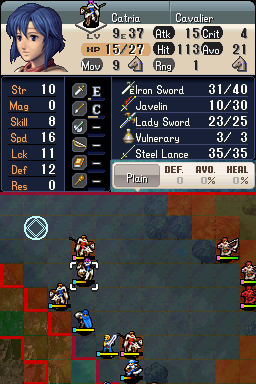
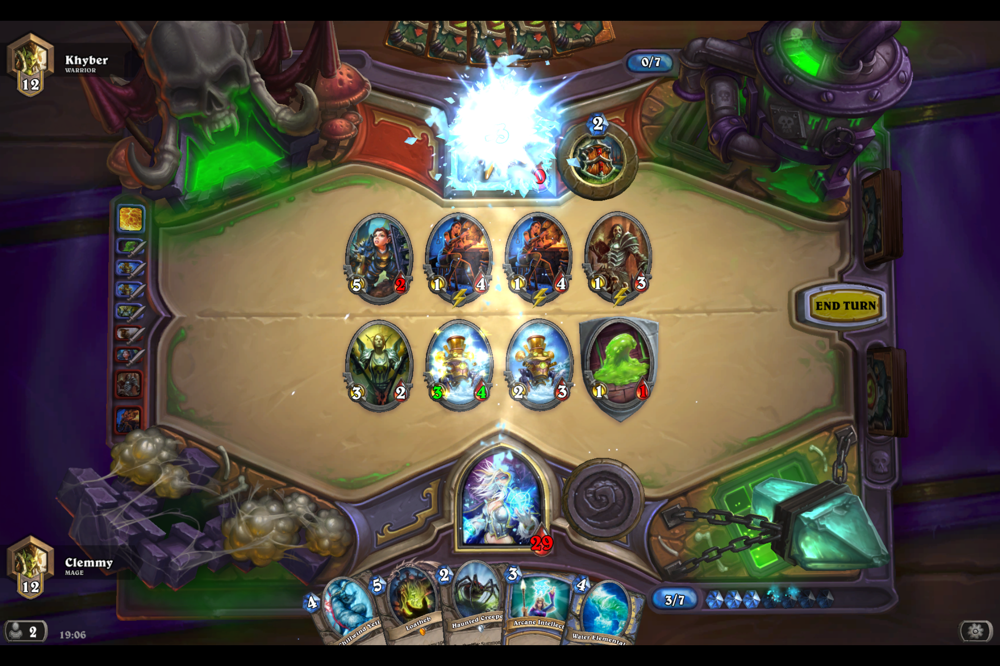

Hello fellow blog readers, and happy holidays! In my last blog post, I said I would try to post more frequently, but this post ended up having a longer period of delay than the rest, unfortunately. I actually began writing this post a few weeks ago, but I never really got around to completing it because of exams (I actually ended up editing this first paragraph around three times). Just a few days ago, I completed a pretty tough 2A term, consisting of six courses: Chemistry, Microeconomics, Statistics, Compilers, Digital Computers, and Computational Logic. With the term now over, it is only weeks before I begin my four-month co-op term as a web developer at [Ten Thousand Coffees](https://www.tenthousandcoffees.com/), _Hurrah!_

Anyway, the main purpose of this post is to talk a bit about gaming. From the several weeks leading up to exams until now, when I am recovering from exams, I have picked up a couple of games. One being [Fire Emblem - Heroes of Light and Shadow](http://fireemblem.wikia.com/wiki/Fire_Emblem:_Shin_Monsh%C5%8D_no_Nazo_~Hikari_to_Kage_no_Eiy%C5%AB~), an addition to one of my favourite video game series, and the other being [Hearthstone](http://us.battle.net/en/int?r=hearthstone), the new free-to-play Collectible Card Game by Blizzard.

#Fire Emblem
The Fire Emblem series is a collection of turn-based tactical RPG video games (Imagine chess on steroids!). Each game generally features a lord character and a beautiful storyline that revolves around that character. The player is the strategist who commands all their characters, and will try to maneuver all the friendly units in a way to successfully achieve the mission goals. There is an experience system involved, so as your units can level up and get stronger. In summary, Fire Emblem contains much of what I look for in a video game: good graphics, good plot, and tactics. More information about this series is available on [Wikipedia](http://en.wikipedia.org/wiki/Fire_Emblem).


##My Experience
I originally started my FE12 run on the second hardest difficulty level of _Lunatic_. Needless to say, the name of speaks for itself; with enemies that can make mincemeat out of my friendly units with one to two attacks, it becomes increasingly vital to correctly place my units so that they won't be OHKO'ed. Combine this with characters that are permanently lost once they die, along with the special win conditions that are required to unlock certain bonuses (such as keeping all characters alive to go to a bonus chapter, or winning within a certain amount of turns), I was in for a very challenging playthrough. I cannot count how many times I had to restart a chapter because I made a minor misplay in unit placement only to get killed, or some unlucky RNG that made clearing the chapter impossible. At the same time, I was busy with university life, and so I had not progressed very far in the game even after months of playing. After a long struggle, I finally decided to re-run the game on Hard difficulty (one level under Lunatic, but exponentially easier!) since I simply want to know the plot, before moving on to the sequel, Fire Emblem - Awakening. On a different note, it sure is difficult to imagine how some people can play on the hardest difficulty, _Reverse Lunatic_ without ripping their hairs out of their head; the enemy stats are boosted just like in Lunatic, but no matter what who initiates the "attack", the enemy will be able to land the first hit. __Shiver__.



#Hearthstone

Onto the more well-known game, Hearthstone! As I said earlier, Hearthstone is a collectible card game made by Blizzard. Coming from a Yugioh background (Yes, I used to be pretty serious in Yugioh; my username is __Killic__ on [DuelingNetwork](http://www.duelingnetwork.com/)), there are several differences in these two card games.

- CCG vs. TCG: Hearthstone is a collectible card game, where cards have to be gathered from card packs or earned through achievements in-game, whereas Yugioh is a trading card game, where cards can be attained from card packs and traded from player to player.
- Simple vs. complicated game mechanics: Hearthstone is a very simple to pick up game; it has very few rules and personally, it only took me a few hours to get accustomed to, whereas in Yugioh, there are many nit-picky rules and even after years of playing, I still find rulings slightly tricky
- Card Pool Difference: In Hearthstone, there are class-specific cards and nine heroes that the player can choose from. Players build decks tailored to their particular hero, and the amount of cards in Hearthstone is quite limited (I am able to recognize around 80% of the current card pool after a few weeks of playing). On the other hand, Yugioh has a much vaster card pool with no class-specific cards. It took me months of playing before becoming familiar with most of the meta, and I still had to keep up to date with it every few weeks.
- Digital vs. Physical: Hearthstone is a digital card game, so most actions are automated by software and rulings are absolute, as decided by the software. However, in Yugioh, there are often ruling debates between players. Additionally, since Yugioh is a physical game, there is an extra layer of the game which involves reading the other player's subtle eye movements, gestures, and card sleeves. Cheating is also more prominent in a physical card game since things like shuffling is not truly randomized.

However, despite these differences, they also both possess similar elements that make them fun to play: they involve elements of strategy, predicting your opponent's possible moves, and countering them. From playing Yugioh, I was able to transfer a lot of my understanding over: tempo, card advantage, early aggression, lethal, card value, and card synergy. Both involve strategy, poker-facing, and a hint of luck!

Playing Hearthstone for a few week, it seems like a game I would be playing for a while, and I am trying to get better in it. I have been playing with pretty budget decks so far, but I am continuing to look for ways to improve my win ratio. Unsurprisingly, there are many resources that Hearthstone players can use to improve their game. It ranges from open-source analytical statistics software such as [Track-o-bot](https://trackobot.com/) and [Hearthstone Deck Tracker](https://github.com/Epix37/Hearthstone-Deck-Tracker) to streaming pro players such as [StrifeCro](http://www.twitch.tv/strifecro) on Twitch, and even using the deck builder tool on [HearthPwn](http://www.hearthpwn.com/). Actually, with so many products out there already, I am finding it hard to come up with something to make for myself. I really want to contribute to the Hearthstone community, but I'm not sure how. If you guys have any suggestions, do comment below!

##My Experience
Overall, Hearthstone has been a very satisfying experience for me so far, despite the amount of times I wanted to flip tables from my opponent's luck. Hearthstone consists of a zero-sum ladder system where for every one player win, there would be exactly one player loss. There is also some MMG to match players up with other players of similar skill levels. In this ladder system, I have thus far made it to Rank 10 in Ranked Constructed play, which I would say is a pretty sweet accomplishment. Before I started playing Hearthstone, I read a few guides and forums to get a feel of the Hearthstone player's mindset. Then, I went through the in-game tutorial, and from there built a very basic deck with the basic cards. After a bit of playtesting with computer AI, I decided to try out Ranked Constructed. Starting at Rank 25, I climbed my way to around Rank 17 before I noticed that I could not really beat the decks that I was facing. They simply had cards that were out of my league, or at least, that was what I thought at that point anyway. At that point, I decided to just throw some spare money into unlocking the Naxxramas wings ($24.99 CAD) and got access to some new cards. At first, I didn't think that they were that good, but over time, I began to have a better feel of card value and tempo. Although, there were certainly similarities to Yugioh, card value was a bit trickier because in Yugioh, one would simply extend their entire hand in the first turn, but Hearthstone has a mana system that limits players to a certain amount of expenditure per turn. By mimicking the way I played in Yugioh, I noticed that I would typically lose matches with a full hand, but not enough mana to make the plays I needed. It was then that I started to change my playstyle a bit, and focus less on pure hand advantage, but to make advantageous trades on the board, while calculating my opponent's possible plays and minimizing their damage through careful usage and saving of my resources. The deck that I took to Rank 10 this season is Undertake Mage, with a bit of other random decks such as budget control warrior. I learned that with this change in playstyle, my resources were better utilized, and legendary cards are actually not so important to winning; it is about your skill, as a deck builder and duelist. However, I also learned that no matter how good your plays are, there are just some games that you cannot win. Hearthstone has a large RNG factor to it and even the best players have a win rate of only around 60-70%.

However, I believe that Hearthstone is quite easy to get into even without any prior card game experience! I recently introduced my younger brother to Hearthstone, and even though it is the first card game he has ever played, he got to rank 16 in under a week. Anyway, I will stop my rambling now and get to the conclusion of this post!

#Conclusion

Both of these games are very fun and I would encourage everyone who is into strategy games to try them out! If anyone wants to add me as a friend on Hearthstone, that would be great. My BattleTag is ```Clemmy#1610```. Happy holidays and happy gaming!


<!--end-->
