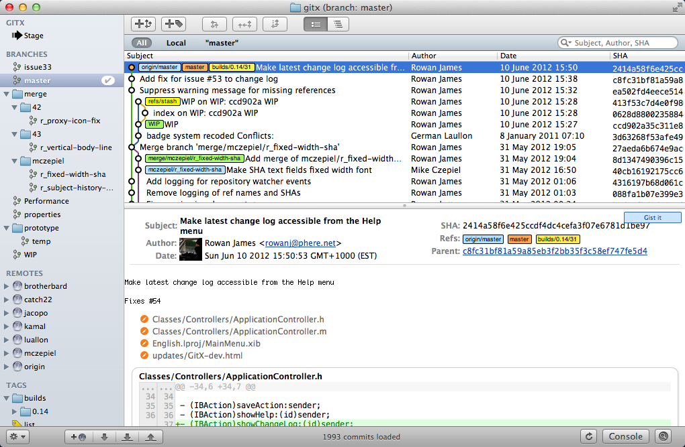
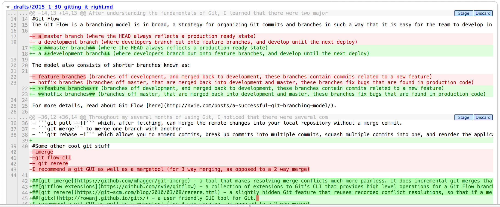
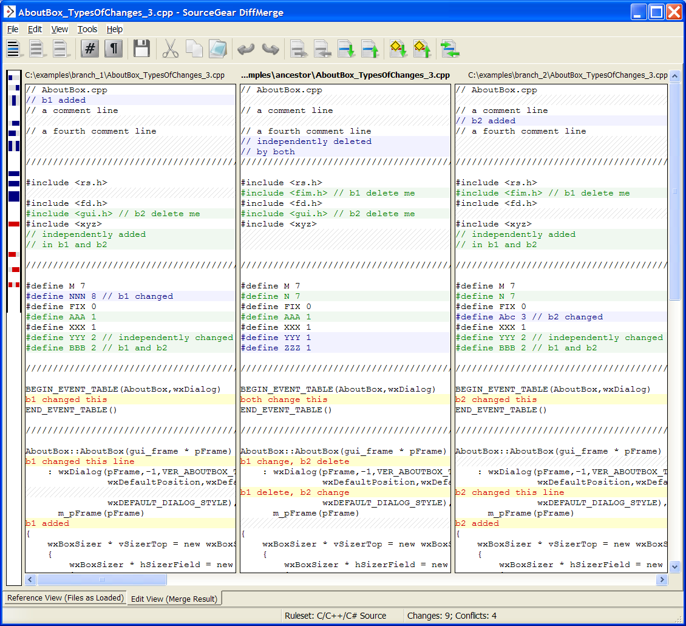

Hello my fellow readers! It's great to post again, and I must say I apologize for being out of touch for so long. I actually started writing this blog post in the middle of my work term at Ten Thousand Coffees, but I delayed it for a while after becoming a bit caught up in work. Without any further ado, let's get to the main content:

For a while now, I have been using Git, but I haven't been _using_ Git (the right way). Instead, I adopted a push/pull flow similar to how central repositories like SVN work. However, thanks to a mandatory training camp I had to undertake during the first week of my co-op term at Ten Thousand Coffees, I did my research on Git and now appreciate its power, and have been using it ever since. Ever since I began 'Gitting it right', I have stopped being afraid of large code changes permanently breaking code, crossing my fingers that my teammates didn't make painfully conflicting changes, and working on multiple different features at once. Instead, Git has significantly improved my programming productivity and helps me dive into problems with the confidence that I can easily navigate around the Git tree and rollback/jump through different stages in the commit history. In fact, I am terrified to write anything without version control now, and evidently, I chose to put both my resume and report under version control in order to utilize powerful Git features such as diffing, comparing revisions, and seeing all the changes I have made.

As a starting point, I personally found Atlassian's set of [tutorials](https://www.atlassian.com/git/tutorials/) to be among the most clear, simple, and concise. It gave me a solid foundation for a majority of the Git statements that I use on a daily basis, and only takes a few hours to read through. Additionally, there's a cool [interactive git tutorial](http://pcottle.github.io/learnGitBranching/).

After understanding the fundamentals of Git, I learned that there were two major workflows for Git. Certain people use the "Rebase workflow", while a vast majority use the "Git Flow workflow". They both have their own specific use cases, where a rebase workflow is focused on having a clean, linear history, and a merge workflow is more concerned about the preservation of history. In practice, I have mainly used a "Git Flow workflow", but more details about a rebase workflow can be found [here](http://randyfay.com/content/rebase-workflow-git).

#Git Flow
The Git Flow is a branching model is in broad, a strategy for organizing Git commits and branches in such a way that it is easy for the team to develop in parallel. It consists of a two infinitely long main branches:

- a **master branch** (where the HEAD always reflects a production ready state)
- a **development branch** (where developers branch out onto feature branches, and develop until the next deploy)

The model also consists of shorter branches known as:

- **feature branches** (branches off development, and merged back to development, these branches contain commits related to a new feature)
- **hotfix branches** (branches off master, that are merged back into development and master, these branches fix bugs that are found in production code)

For more details, read about Git Flow [here](http://nvie.com/posts/a-successful-git-branching-model/).

#Some git commands I use regularly
Throughout my several months of using Git, I noticed that there were several commands I used very often.

- ```git checkout <file> <commit_id>``` which grabs a file from a specific revision
- ```git checkout -- .``` which replaces all unstaged changes with the corresponding files from the previous commit
- ```git reset --hard <commit_id>``` which moves your local HEAD to the specified commit_id. It's useful when you want to move your HEAD to a diverged commit, or when you make a bad commit locally.
- ```git add <file>``` which simply adds a changed file to the stage area
- ```git fetch``` which grabs data about the git repository from the specified remote, and can be followed by a ```git pull``` or ```git rebase``` to update your local repo
- ```git status``` which displays status about your repository, such as what files are staged, unstaged, and your HEAD's position relative to the tracked repository
- ```git pull --ff``` which, after fetching, can merge the remote changes into your local repository without a merge commit.
- ```git merge``` to merge one branch with another
- ```git rebase -i``` which allows you to amend commits, break up commits into multiple commits, squash multiple commits into one, and reorder the application of commit diffs. It is a very powerful feature which allows you to organize your git commits locally before pushing, and can make the difference between [this](../images/in_post_images/clean-git-tree.png) and [this](../images/in_post_images/messy-git-tree.png).

#Some other cool git stuff

###[git imerge](https://github.com/mhagger/git-imerge)
a tool that makes resolving merge conflicts much more painless. It does incremental git merges that can be saved tested, interrupted, and collaborated all while the merge is in progress.
###[gitflow extensions](https://github.com/nvie/gitflow)
a collection of extensions to Git's CLI that provides high level operations for a Git Flow branching model
###[git rerere](https://git-scm.com/blog/2010/03/08/rerere.html)
a slightly hidden Git feature that reuses recorded conflict resolutions, so that if a merge has to be re-applied, all the conflicts don't have to be solved again

#What about a GUI and merge tools?

##Graphical git clients
I highly recommend using a GUI for Git and a merge tool as well. Personally, I use [GitX](http://rowanj.github.io/gitx/) since I am on a Mac. Using a GUI allows me to visualize how the git tree looks a lot better, and allows me to stage line by line. With GitX, there is a lot more control to how I want to commit, and it is much easier for me to understand what is happening to my git tree. Of course, I do not rely completely on GitX. I believe that the best way to use Git is through the terminal, but with GitX as a supplement that makes it more productive.





##Merge tools
In addition to using a graphical Git client, I also recommend using a tool to help with merging conflicts. For trivial conflicts, it may be painless to simply open up an editor and manually make changes to fix the conflicts, but for a complex situation where there are many files that need to be changed, with multiple conflicts per file, it is much more productive to use a merge tool to resolve them. Also, many git merge tools have the additional functionality of three-way merges instead of a basic two-way merge. A three-way merge is one that finds the common ancestor in the git tree, and tries to apply the diffs of the diverging commits into the common base, which makes the conflict look more sensible. I use [DiffMerge](https://sourcegear.com/diffmerge/) as my merge tool, but only because it works and I haven't had the need to try anything else thus far.



#One of my craziest experiences with Git
One of the tasks I was assigned to do at my last internship was to split a repository of ~6000 commits into 2 repos: server and client repositories, while retaining the branch structures and history. To do so, I first had to rebase interactively all the way from the beginning of time. In each commit, I amended it so that all changes that were relevant to the server would go to one commit, and all the changes that were relevant to the client would go to another. Then, in a second interactive rebase, I moved all the client-relevant commits to after the latest server-relevant commit, so that the commit tree was partitioned into two main chunks of commits: server-relevant, and client-relevant. Next, I created the new repository for the client commits, and simply set it as a remote, and pushed all my client-relevant code onto it. Finally, I went back to my server repository, and reset it to the latest commit that was server-related, and voila, the repository has been separated. In this paragraph, I made it seem pretty simple, but I assure you, there was a lot of pain and WTF moments during the actual process. I explored with patches among other features, and learned about the prowess of Git-fu.

#Conclusions
All in all, I hope that this post is useful to anyone who was hesitant about learning Git, or even someone who is already a Git veteran by teaching them a new trick or two about Git. As the saying goes, "Know your tools well". Code hard and remember to version control!
<!--end-->
